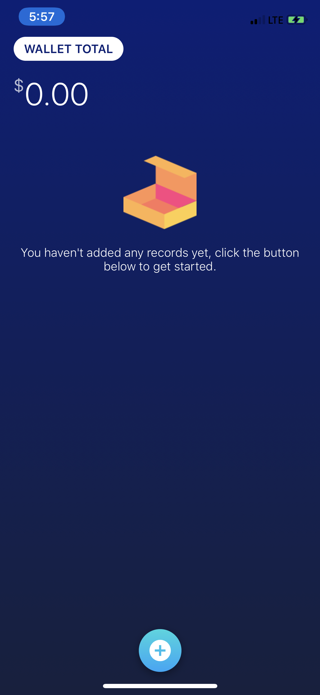
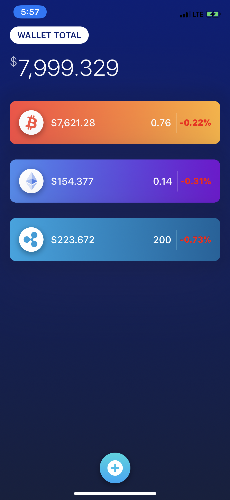
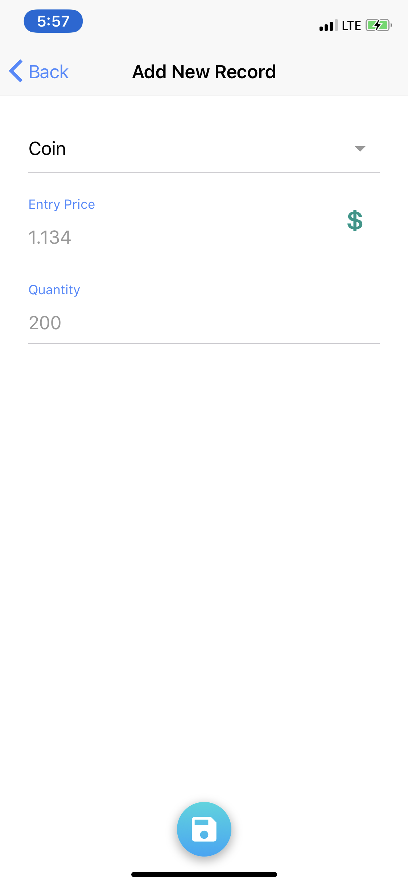
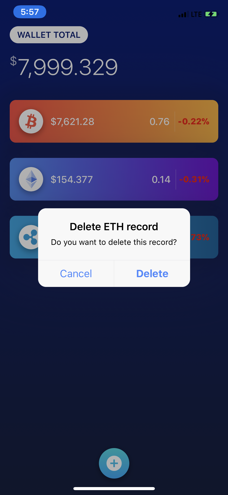

# Mobile-Applications-Project--Portfolio-App


A simple ionic 3 crypto portfolio app I made for my Mobile Applications Class






## Building

#### NPM
Clone this repo
````bash 
git clone https://github.com/ola-wale/Mobile-Applications-Project--Portfolio-App.git
````
Install Dependencies
````bash 
npm i
````
Serve with ionic
````bash 
ionic serve
````

UI inspired by <a>https://dribbble.com/shots/4109457-Crypto-Wallet-App/attachments/941123</a>
